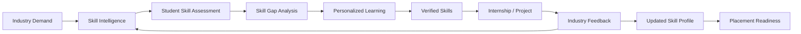
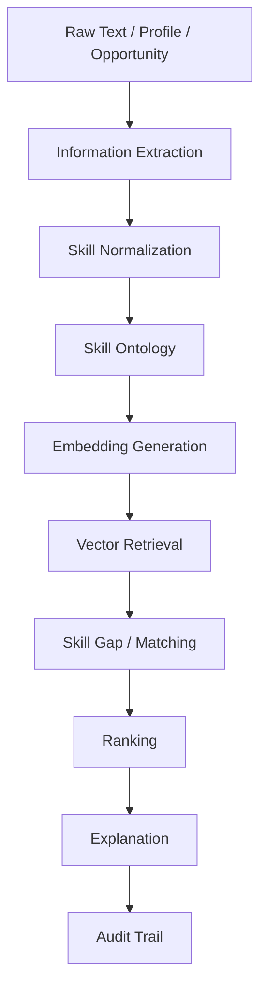
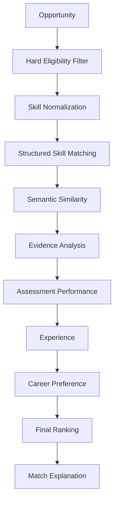
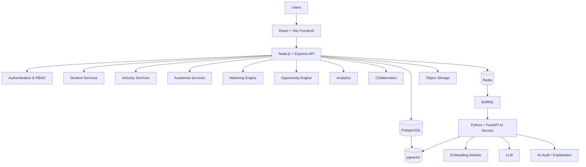
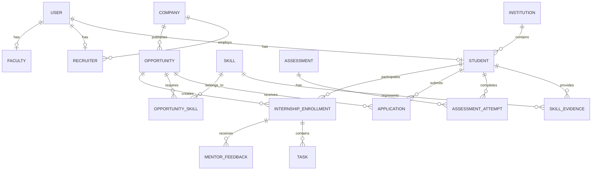

<div align="center">


  
# 🎓 EduNexus

### AI-Powered Academia–Industry Skill Intelligence Platform

**Bridging Skills · Connecting Opportunities · Building Careers**

EduNexus is a unified platform designed to connect **students, educational institutions, and industry** through skill intelligence, career guidance, internships, placements, and structured academia–industry collaboration.

<p>
  
  
  
  
  
</p>

[Overview](#-overview) •
[Problem](#-problem-statement) •
[Solution](#-solution) •
[Features](#-key-features) •
[Architecture](#-system-architecture) •
[AI](#-ai--skill-intelligence) •
[Setup](#-getting-started) •
[Roadmap](#-roadmap)

</p>
</div>

--- 

## 📌 Project Information

|                       | Details                                                                                 |
| --------------------- | --------------------------------------------------------------------------------------- |
| **Project Name**      | EduNexus                                                                                |
| **Problem Statement** | SIH 2026 – 26044                                                                        |
| **Title**             | Portal for Academia–Industry Collaboration for Skill Mapping, Internships and Placement |
| **Organization**      | Ministry of Ayush / All India Institute of Ayurveda                                     |
| **Category**          | Software                                                                                |
| **Domain**            | Education / Skill Development / Employment                                              |
| **Core Technology**   | AI + Skill Intelligence + Web Platform                                                  |
| **Primary Users**     | Students, Industry, Academia, Administrators                                            |

---

# 🚀 Overview

**EduNexus** is an AI-powered platform designed to bridge the gap between **academic education and industry requirements**.

Students often graduate with theoretical knowledge but lack visibility into the skills expected by employers. At the same time, organizations struggle to discover candidates with the right combination of skills and evidence. Educational institutions also lack real-time visibility into changing industry requirements.

EduNexus brings these stakeholders into a single ecosystem.

The platform connects:

```text
Industry Demand
      ↓
Skill Intelligence
      ↓
Student Assessment
      ↓
Skill Profile
      ↓
Skill Gap Analysis
      ↓
Personalized Learning
      ↓
Verified Skills
      ↓
Internships / Projects
      ↓
Industry Feedback
      ↓
Placement Readiness
```

The goal is not simply to create another job or internship portal.

The goal is to create a **continuous intelligence loop between students, academia, and industry**.

---

# 🎯 Problem Statement

There is a significant gap between the skills acquired in academic institutions and the competencies expected by industries.

## 👨‍🎓 Students

Students frequently struggle with:

* Identifying skills required for their target career
* Understanding their current competency level
* Identifying skill gaps
* Finding relevant internships
* Finding industry projects
* Knowing which certifications are valuable
* Demonstrating practical skills
* Building credible digital portfolios
* Understanding placement readiness

## 🏢 Industry

Organizations face challenges such as:

* Finding candidates with relevant skills
* Filtering large candidate pools
* Verifying claimed skills
* Finding suitable internship candidates
* Communicating changing skill requirements
* Collaborating with institutions
* Finding candidates for live projects and training programs

## 🏫 Academia

Educational institutions struggle with:

* Tracking student skill readiness
* Understanding current industry demand
* Identifying department-level skill gaps
* Aligning curriculum with industry requirements
* Tracking internships
* Monitoring placement outcomes
* Creating meaningful industry collaborations
* Understanding emerging technologies

---

# 💡 Solution

EduNexus creates a unified ecosystem connecting:

```text
┌─────────────────┐
│     STUDENT     │
│                 │
│ Skills          │
│ Assessments     │
│ Projects        │
│ Learning        │
│ Internships     │
└────────┬────────┘
         │
         │
         ▼
┌─────────────────────────┐
│    EDUNEXUS INTELLIGENCE│
│                         │
│ Skill Intelligence      │
│ AI Matching             │
│ Skill Gap Analysis      │
│ Recommendations         │
│ Industry Demand         │
│ Analytics               │
└───────────┬─────────────┘
            │
       ┌────┴─────┐
       ▼          ▼
┌───────────┐ ┌───────────┐
│ ACADEMIA  │ │ INDUSTRY  │
│           │ │           │
│ Analytics │ │ Hiring    │
│ Curriculum│ │ Internships│
│ Skill Gaps│ │ Projects  │
│ Placements│ │ Feedback  │
└───────────┘ └───────────┘
```

---

# 🌟 Vision

> **Create a continuously learning ecosystem where industry demand directly influences skill development, students build evidence-backed careers, and institutions make data-driven academic decisions.**

---

# 🔥 Core Intelligence Loop

EduNexus is built around a continuous feedback loop.



This loop is the core differentiator of EduNexus.

---

# ✨ Key Features

# 👨‍🎓 Student Platform

## 1. Student Dashboard

The student dashboard provides a personalized overview of:

* Skill readiness
* Current skills
* Skill gaps
* Recommended learning
* Recommended internships
* Applications
* Upcoming assessments
* Career progress
* Placement readiness

---

## 2. Digital Skill Passport

Each student receives a dynamic **Skill Passport**.

The passport can contain:

```text
Student
│
├── Academic Profile
├── Technical Skills
├── Soft Skills
├── Assessments
├── Certifications
├── Projects
├── GitHub Evidence
├── Internships
├── Industry Feedback
└── Verified Credentials
```

Instead of simply storing:

```text
React.js
Node.js
MongoDB
```

EduNexus can store evidence such as:

```text
React.js
├── Self Declared
├── Assessment Score
├── Project Evidence
├── Certification
└── Industry Feedback
```

---

# 3. Skill Assessment Engine

Students can assess their knowledge through:

* Technical assessments
* Domain assessments
* Skill-specific tests
* Knowledge evaluations
* Project-based evidence

Assessment results contribute to the student's skill profile.

---

# 4. AI Skill Gap Analysis

Students can select a target role.

Example:

```text
Target Role
Full Stack Developer
        ↓
Required Skills
        ↓
Compare with Student Profile
        ↓
Identify Missing / Weak Skills
        ↓
Generate Skill Gap
```

Example:

```text
Target: Full Stack Developer

✓ JavaScript
✓ React.js
✓ Node.js
✓ REST APIs
✓ MongoDB

△ Docker
△ System Design
✗ Cloud Deployment
```

---

# 5. Personalized Learning Path

EduNexus can recommend learning resources based on the student's skill gaps.

```text
Skill Gap
    ↓
Required Competency
    ↓
Learning Resources
    ↓
Practice
    ↓
Assessment
    ↓
Skill Improvement
```

Recommendations can include:

* Courses
* Certifications
* Training programs
* Projects
* Practice activities
* Workshops

---

# 6. Career Pathways

Students can define a career target and receive a structured roadmap.

Example:

```text
Frontend Developer
       ↓
React Developer
       ↓
Full Stack Developer
       ↓
Software Engineer
```

Each transition can identify:

* Required skills
* Current skills
* Missing skills
* Learning recommendations
* Relevant projects
* Internship opportunities

---

# 7. Internship & Opportunity Discovery

Students can discover:

* Internships
* Jobs
* Apprenticeships
* Live projects
* Training programs
* Workshops
* Mentorship opportunities

Filters include:

* Skills
* Role
* Location
* Remote/onsite
* Duration
* Organization
* Eligibility
* Opportunity type

---

# 8. Explainable Opportunity Matching

Instead of showing:

```text
Match: 87%
```

EduNexus should explain:

```text
87% Match

Strong Matches
✓ React.js
✓ Node.js
✓ REST APIs
✓ Git

Moderate
△ MongoDB

Gap
✗ Docker

Evidence
✓ 3 relevant projects
✓ Technical assessment completed
✓ Previous internship
```

---

# 9. Application Tracking

Students can track:

```text
Applied
   ↓
Under Review
   ↓
Shortlisted
   ↓
Interview
   ↓
Selected
   ↓
Internship / Job
```

---

# 10. Internship Workspace

Once selected, students receive a dedicated workspace containing:

* Internship details
* Tasks
* Milestones
* Deadlines
* Mentor communication
* Progress
* Feedback
* Completion status

---

# 11. Portfolio

Students can build a digital portfolio containing:

* Projects
* Skills
* Certifications
* Internships
* Achievements
* Assessments
* Industry feedback

---

# 🏢 Industry Platform

## 1. Organization Profile

Companies can maintain verified organization profiles.

---

## 2. Opportunity Management

Industry users can create:

* Internships
* Jobs
* Apprenticeships
* Live projects
* Training programs
* Workshops
* Mentorship programs

---

## 3. Skill Requirement Builder

Organizations define:

```text
Role
 ↓
Required Skills
 ↓
Preferred Skills
 ↓
Proficiency
 ↓
Eligibility
 ↓
Experience
```

---

# 4. Intelligent Candidate Search

Recruiters can search candidates using:

* Skills
* Proficiency
* Assessments
* Projects
* Experience
* Certifications
* Evidence
* Eligibility

---

# 5. Candidate Evidence View

Recruiters can inspect why a candidate claims a skill.

Example:

```text
React.js

Assessment       → 86%
Projects         → 3
Certification    → 1
Internship       → 1
Industry Feedback→ Strong
```

---

# 6. Recruitment Pipeline

```text
Applications
     ↓
Screening
     ↓
Shortlist
     ↓
Interview
     ↓
Selection
     ↓
Offer
```

---

# 7. Industry Feedback

Organizations can provide feedback after internships and projects.

Feedback can update:

* Skill confidence
* Practical experience
* Industry verification
* Student development profile

---

# 8. Industry Skill Demand Intelligence

EduNexus aggregates opportunity requirements to identify:

* Most demanded skills
* Emerging technologies
* Role-specific demand
* Industry-specific demand
* Skill combinations
* Demand trends

---

# 🏫 Academia Platform

## 1. Institution Dashboard

Institutions can monitor:

* Student readiness
* Department readiness
* Skill distribution
* Skill gaps
* Industry demand
* Internship participation
* Placement outcomes

---

# 2. Cohort Skill Analytics

Institutions can analyze:

```text
College
 ├── Department
 │    ├── Batch
 │    │    ├── Student
 │    │    └── Skills
 │    └── Skill Gaps
 └── Placement Outcomes
```

---

# 3. Industry Demand vs Student Skills

Example:

```text
Industry Demand
────────────────────────────
React.js       ██████████
Node.js        █████████
Docker         ███████
AWS            ██████
System Design  █████

Student Skills
────────────────────────────
React.js       ████████
Node.js        ██████
Docker         ████
AWS            ███
System Design  ██
```

This helps institutions identify where additional training is required.

---

# 4. Curriculum Alignment

Institutions can compare:

```text
Curriculum
     ↕
Industry Required Skills
     ↓
Alignment Score
     ↓
Curriculum Gaps
```

---

# 5. Internship & Placement Monitoring

Institutions can monitor:

* Internship participation
* Internship completion
* Placement outcomes
* Department performance
* Industry engagement
* Student readiness

---

# 6. Faculty Opportunities

Faculty can discover:

* FDPs
* Industrial training
* Workshops
* Guest lectures
* Consultancy
* Research collaboration

---

# 🤝 Academia–Industry Collaboration

EduNexus supports collaboration beyond recruitment.

```text
Academia
    ↕
Industry
    │
    ├── Internships
    ├── Workshops
    ├── Guest Lectures
    ├── Mentorship
    ├── Live Projects
    ├── Research
    ├── Consultancy
    ├── FDPs
    └── Curriculum Consultation
```

---

# 🛡️ Skill Trust & Verification

EduNexus follows an evidence-oriented skill model.

```text
Self Declared
      ↓
Assessed
      ↓
Project Evidence
      ↓
Institution Verified
      ↓
Industry Verified
```

A skill can have multiple evidence sources.

### Example

```text
Skill: Node.js

Self Assessment      → Basic
Technical Assessment → Strong
Project Evidence     → Strong
Internship           → Practical
Industry Feedback    → Verified
```

This creates a more meaningful skill profile than a simple list of technologies.

---

# 🤖 AI & Skill Intelligence

AI is used as the intelligence layer of EduNexus.

It supports:

* Skill extraction
* Skill normalization
* Semantic understanding
* Skill gap detection
* Opportunity matching
* Learning recommendations
* Industry demand analysis
* Explainable recommendations

---

# 🧠 AI Processing Pipeline



---

# 🔤 Skill Normalization

Different terms may refer to the same skill.

Example:

```text
React
ReactJS
React.js
React JS
```

are normalized to:

```text
React.js
```

This enables consistent analytics and matching.

---

# 🧩 Skill Ontology

Skills are represented as a structured knowledge system.

Example:

```text
JavaScript
   │
   ├── React.js
   ├── Node.js
   ├── Express.js
   └── Next.js
```

Relationships can include:

```text
RELATED_TO
PREREQUISITE_OF
SUBSKILL_OF
USED_WITH
REQUIRED_FOR
```

---

# 🔎 Semantic Search

EduNexus can use embeddings to understand semantic similarity.

For example:

```text
"Frontend development using React"
```

can be semantically related to:

```text
React.js
JavaScript
Frontend Development
UI Development
```

This is more powerful than exact keyword matching.

---

# 🎯 Matching Engine

EduNexus uses a hybrid matching strategy.



---

# 📊 Matching Score

A configurable initial model can use:

| Signal                 | Weight |
| ---------------------- | -----: |
| Skill Compatibility    |    35% |
| Skill Evidence         |    20% |
| Assessment Performance |    15% |
| Experience             |    10% |
| Career Preference      |    10% |
| Eligibility            |     5% |
| Stated Preferences     |     5% |

These weights should be treated as **configurable starting values** and validated against evaluation data.

---

# ⚖️ Fairness

The matching engine should not use protected or irrelevant attributes.

The ranking system should focus on:

* Relevant skills
* Evidence
* Assessments
* Experience
* Eligibility
* Career preferences

It should not use:

* Gender
* Religion
* Caste
* Ethnicity
* Political affiliation
* Personal background
* Institution prestige as a proxy for ability

---

# 🏗️ System Architecture



---

# 🧱 Technology Stack

## Frontend

| Technology     | Purpose                 |
| -------------- | ----------------------- |
| React.js       | UI                      |
| Vite           | Development/build       |
| JavaScript     | Application language    |
| Tailwind CSS   | Styling                 |
| React Router   | Routing                 |
| TanStack Query | Server-state management |
| Axios          | API communication       |

## Backend

| Technology      | Purpose          |
| --------------- | ---------------- |
| Node.js         | Runtime          |
| Express.js      | REST API         |
| JavaScript      | Backend language |
| JWT             | Authentication   |
| bcrypt / Argon2 | Password hashing |

## Database

| Technology | Purpose                        |
| ---------- | ------------------------------ |
| PostgreSQL | Primary relational database    |
| pgvector   | Vector similarity search       |
| Neo4j      | Optional skill knowledge graph |

## AI

| Technology            | Purpose            |
| --------------------- | ------------------ |
| Python                | AI service         |
| FastAPI               | AI APIs            |
| Sentence Transformers | Embeddings         |
| LLM                   | NLP / reasoning    |
| Vector Search         | Semantic retrieval |

## Infrastructure

| Technology            | Purpose          |
| --------------------- | ---------------- |
| Redis                 | Cache / queue    |
| BullMQ                | Background jobs  |
| S3-compatible storage | Documents        |
| Docker                | Containerization |
| OpenTelemetry         | Observability    |

---

# 📂 Project Structure

```text
EduNexus/
│
├── frontend/
│   ├── src/
│   │   ├── assets/
│   │   ├── components/
│   │   │   ├── common/
│   │   │   ├── forms/
│   │   │   ├── charts/
│   │   │   └── tables/
│   │   │
│   │   ├── layouts/
│   │   ├── pages/
│   │   │   ├── public/
│   │   │   ├── student/
│   │   │   ├── industry/
│   │   │   ├── academia/
│   │   │   └── admin/
│   │   │
│   │   ├── features/
│   │   │   ├── auth/
│   │   │   ├── skills/
│   │   │   ├── assessments/
│   │   │   ├── learning/
│   │   │   ├── opportunities/
│   │   │   ├── matching/
│   │   │   ├── applications/
│   │   │   ├── internships/
│   │   │   ├── collaboration/
│   │   │   └── analytics/
│   │   │
│   │   ├── services/
│   │   ├── hooks/
│   │   ├── context/
│   │   ├── routes/
│   │   ├── validators/
│   │   ├── utils/
│   │   ├── App.jsx
│   │   └── main.jsx
│   │
│   └── package.json
│
├── backend/
│   ├── src/
│   │   ├── config/
│   │   ├── routes/
│   │   ├── controllers/
│   │   ├── services/
│   │   ├── repositories/
│   │   ├── models/
│   │   ├── middleware/
│   │   ├── validators/
│   │   ├── utils/
│   │   ├── jobs/
│   │   ├── integrations/
│   │   │
│   │   ├── modules/
│   │   │   ├── auth/
│   │   │   ├── users/
│   │   │   ├── students/
│   │   │   ├── industry/
│   │   │   ├── academia/
│   │   │   ├── skills/
│   │   │   ├── assessments/
│   │   │   ├── learning/
│   │   │   ├── opportunities/
│   │   │   ├── matching/
│   │   │   ├── applications/
│   │   │   ├── internships/
│   │   │   ├── collaboration/
│   │   │   ├── analytics/
│   │   │   ├── documents/
│   │   │   └── notifications/
│   │   │
│   │   ├── app.js
│   │   └── server.js
│   │
│   └── package.json
│
├── ai-service/
│   ├── app/
│   │   ├── api/
│   │   ├── models/
│   │   ├── services/
│   │   ├── pipelines/
│   │   ├── embeddings/
│   │   ├── matching/
│   │   ├── prompts/
│   │   └── main.py
│   │
│   └── requirements.txt
│
├── database/
│   ├── migrations/
│   ├── seeds/
│   └── schema/
│
├── docs/
│   ├── architecture/
│   ├── api/
│   ├── database/
│   └── ai/
│
├── docker-compose.yml
├── .env.example
├── .gitignore
└── README.md
```

---

# 🗄️ Database Architecture

EduNexus uses **PostgreSQL** as the primary relational database.

## Identity Domain

```text
users
roles
students
faculty
institutions
companies
recruiters
mentors
```

## Skill Domain

```text
skills
skill_aliases
skill_relations
skill_levels
skill_evidence
skill_assessments
```

## Learning Domain

```text
courses
certifications
training_programs
learning_plans
recommendations
```

## Opportunity Domain

```text
internships
jobs
projects
fdps
workshops
collaborations
```

## Recruitment Domain

```text
applications
shortlists
interviews
offers
placement_outcomes
```

## Internship Domain

```text
internship_enrollments
tasks
milestones
mentor_feedback
completion_records
```

## Trust Domain

```text
credentials
verifications
documents
consents
audit_logs
```

## Analytics Domain

```text
skill_demand_snapshots
cohort_metrics
readiness_scores
curriculum_alignment
placement_metrics
```

---

# 🔗 Core Entity Relationships



---

# 🔌 API Architecture

EduNexus follows REST API principles.

## Authentication

```http
POST /api/auth/register
POST /api/auth/login
POST /api/auth/refresh
POST /api/auth/logout
```

## Student

```http
GET   /api/students/me
PATCH /api/students/me
GET   /api/students/me/skills
PATCH /api/students/me/skills
GET   /api/students/me/portfolio
```

## Skills

```http
GET  /api/skills
GET  /api/skills/:id
POST /api/skills/evidence
```

## Assessments

```http
GET  /api/assessments
POST /api/assessments/:id/attempts
GET  /api/assessments/attempts/:id
```

## Opportunities

```http
GET  /api/opportunities
GET  /api/opportunities/:id
POST /api/opportunities
```

## Matching

```http
GET  /api/matches/opportunities
POST /api/matches/explain
```

## Applications

```http
POST  /api/applications
GET   /api/applications/me
PATCH /api/applications/:id/status
```

## Internships

```http
GET  /api/internships
POST /api/internships
POST /api/internships/:id/tasks
POST /api/internships/:id/feedback
```

## Academia

```http
GET /api/academia/analytics
GET /api/academia/skill-gaps
GET /api/academia/curriculum-alignment
```

## Industry

```http
GET  /api/industry/candidates
GET  /api/industry/demand
POST /api/industry/opportunities
```

API contracts should ultimately be documented through **OpenAPI/Swagger**.

---

# 🔐 Authentication & Authorization

EduNexus uses layered authorization.

```text
Request
   ↓
JWT Validation
   ↓
User Authentication
   ↓
Role Check
   ↓
Organization Scope
   ↓
Resource Ownership
   ↓
Permission
   ↓
Controller
```

Supported access roles can include:

| Role              | Primary Responsibility          |
| ----------------- | ------------------------------- |
| Student           | Skills, learning, opportunities |
| Recruiter         | Hiring and opportunities        |
| Industry Mentor   | Internship feedback             |
| Faculty           | Student development             |
| Placement Admin   | Placement monitoring            |
| Institution Admin | Institutional analytics         |
| Platform Admin    | System administration           |

---

# 🛡️ Security

Security controls include:

* JWT authentication
* Refresh-token rotation
* Secure password hashing
* RBAC
* Resource-level authorization
* Input validation
* Rate limiting
* Secure document access
* Audit logging
* HTTPS
* Database constraints
* Least privilege

### Important Rules

Never trust:

```text
Client-supplied role
Client-supplied user ID
Client-supplied ownership
Client-side permissions
```

Authorization must always be validated on the server.

---

# 📄 Document Management

Documents can include:

* Resumes
* Certificates
* Project evidence
* Internship documents
* Training certificates
* Other authorized evidence

Recommended architecture:

```text
Frontend
   ↓
Backend Authorization
   ↓
Object Storage
   ↓
Metadata → PostgreSQL
```

Verification lifecycle:

```text
Pending
   ↓
Under Review
   ↓
Verified / Rejected
   ↓
Expired
```

---

# ⚡ Background Processing

Redis + BullMQ can be used for asynchronous workloads.

Examples:

```text
Resume Upload
     ↓
Queue
     ↓
AI Processing
     ↓
Skill Extraction
     ↓
Normalization
     ↓
Embedding
     ↓
Profile Update
```

Other background tasks:

* Recommendation refresh
* Notifications
* Embedding generation
* Skill-demand aggregation
* Analytics generation
* Document processing

---

# 📊 Analytics Architecture

EduNexus provides analytics at multiple levels.

## Student

* Skill readiness
* Skill gaps
* Assessment performance
* Career readiness
* Application performance

## Institution

* Department skill distribution
* Cohort readiness
* Industry demand
* Curriculum alignment
* Internship participation
* Placement outcomes

## Industry

* Skill demand
* Candidate availability
* Recruitment funnel
* Opportunity performance

## Platform

* Users
* Opportunities
* Applications
* Matching
* Internship conversion
* Placement outcomes

---

# 🧠 AI Governance

AI should assist decision-making rather than silently control high-impact decisions.

### AI should provide:

* Recommendations
* Rankings
* Explanations
* Confidence indicators
* Supporting evidence

### AI should not independently make:

* Final hiring decisions
* Irreversible eligibility decisions
* Access-control decisions
* Disciplinary decisions

High-impact workflows should maintain appropriate **human oversight**.

---

# ⚙️ Non-Functional Requirements

## Performance

The platform should aim for:

* Fast dashboard loading
* Efficient database indexing
* Cached repeated queries
* Asynchronous AI workloads
* Vector search optimization

## Scalability

Architecture should support:

```text
Multiple Institutions
        ↓
Multiple Departments
        ↓
Large Student Population
        ↓
Multiple Organizations
        ↓
Large Opportunity Dataset
```

## Reliability

* Database backups
* Health checks
* Error logging
* Retryable jobs
* Graceful failure
* Monitoring

---

# 🧪 Testing Strategy

## Unit Testing

Test:

* Services
* Utilities
* Validators
* Matching calculations
* AI helper functions

## Integration Testing

Test:

* API + database
* Authentication
* Applications
* Opportunity workflows
* Analytics

## End-to-End Testing

Test the complete student journey:

```text
Register
 ↓
Create Profile
 ↓
Assessment
 ↓
Skill Profile
 ↓
Skill Gap
 ↓
Learning
 ↓
Opportunity
 ↓
Matching
 ↓
Application
 ↓
Shortlist
 ↓
Internship
 ↓
Mentor Feedback
 ↓
Skill Verification
 ↓
Placement Readiness
```

## AI Evaluation

Evaluate:

* Skill extraction accuracy
* Skill normalization accuracy
* Matching quality
* Recommendation relevance
* Explanation quality
* Hallucination rate
* Confidence calibration

---

# 🚀 Getting Started

## Prerequisites

Install:

* Node.js
* npm
* Python
* PostgreSQL
* Redis
* Git
* Docker (recommended)

---

# 1️⃣ Clone Repository

```bash
git clone https://github.com/<your-username>/EduNexus.git

cd EduNexus
```

---

# 2️⃣ Frontend Setup

```bash
cd frontend

npm install

npm run dev
```

---

# 3️⃣ Backend Setup

```bash
cd ../backend

npm install

npm run dev
```

---

# 4️⃣ AI Service Setup

```bash
cd ../ai-service

python -m venv venv
```

### Windows

```bash
venv\Scripts\activate
```

### Linux / macOS

```bash
source venv/bin/activate
```

Install dependencies:

```bash
pip install -r requirements.txt
```

Run:

```bash
uvicorn app.main:app --reload
```

---

# 🔑 Environment Variables

Create `.env` files based on `.env.example`.

Example:

```env
PORT=5000

DATABASE_URL=

JWT_SECRET=
JWT_REFRESH_SECRET=

REDIS_URL=

AI_SERVICE_URL=

OBJECT_STORAGE_ENDPOINT=
OBJECT_STORAGE_BUCKET=
OBJECT_STORAGE_ACCESS_KEY=
OBJECT_STORAGE_SECRET_KEY=

LLM_API_KEY=
```

> Never commit real secrets, tokens, passwords, or API keys.

---

# 🐳 Docker

Start infrastructure:

```bash
docker compose up -d
```

Expected services may include:

```text
PostgreSQL
Redis
Object Storage
Neo4j (optional)
```

---

# 🌐 Application Flow

```text
                         EDUNEXUS
                             │
            ┌────────────────┼────────────────┐
            │                │                │
            ▼                ▼                ▼
        Student          Industry         Academia
            │                │                │
            ▼                ▼                ▼
       Skill Passport   Opportunities     Analytics
            │                │                │
            ▼                ▼                ▼
       Assessments       Skill Demand     Skill Gaps
            │                │                │
            └───────────────┬┴────────────────┘
                            ▼
                     AI INTELLIGENCE
                            │
              ┌─────────────┼─────────────┐
              ▼             ▼             ▼
           Matching       Learning      Analytics
              │             │             │
              └─────────────┼─────────────┘
                            ▼
                       Internship
                            ↓
                    Industry Feedback
                            ↓
                     Verified Skills
                            ↓
                     Placement Ready
```

---

# 🏆 What Makes EduNexus Different?

EduNexus is not intended to be only:

```text
❌ Job Portal
❌ Internship Portal
❌ Learning Platform
❌ College ERP
```

It combines these capabilities through a **skill intelligence layer**.

### Traditional model

```text
Student → Resume → Job → Application
```

### EduNexus model

```text
Industry Demand
      ↓
Skill Intelligence
      ↓
Student Skill Passport
      ↓
Assessment
      ↓
Gap Analysis
      ↓
Learning
      ↓
Evidence
      ↓
Internship
      ↓
Industry Feedback
      ↓
Verified Skills
      ↓
Placement
```

This creates a continuous ecosystem instead of a one-time recruitment transaction.

---

# 🎬 Recommended SIH Demo Flow

A strong demonstration should follow one complete user story.

## Step 1 — Student Registration

Create a student profile.

## Step 2 — Skill Assessment

Student completes a technical assessment.

## Step 3 — Skill Passport

EduNexus generates an evidence-backed skill profile.

## Step 4 — Career Selection

Student selects:

```text
Target Role → Full Stack Developer
```

## Step 5 — AI Gap Analysis

System identifies missing skills.

## Step 6 — Learning Recommendation

AI recommends learning resources.

## Step 7 — Industry Opportunity

A company publishes:

```text
Full Stack Developer Internship
```

with required skills.

## Step 8 — AI Matching

EduNexus identifies suitable candidates.

## Step 9 — Explainable Match

System explains:

```text
Why this candidate?
What skills match?
What evidence exists?
What gaps remain?
```

## Step 10 — Application

Student applies.

## Step 11 — Internship Workspace

Student completes assigned tasks.

## Step 12 — Industry Feedback

Mentor evaluates the student.

## Step 13 — Skill Verification

Relevant skills are updated using internship evidence.

## Step 14 — Academia Dashboard

Institution sees:

```text
Student Improvement
        ↓
Department Readiness
        ↓
Industry Demand
        ↓
Skill Gaps
        ↓
Curriculum Alignment
```

This demonstrates the complete EduNexus intelligence loop.

---

# 🗺️ Development Roadmap

## Phase 1 — Foundation

* [ ] Repository architecture
* [ ] Authentication
* [ ] RBAC
* [ ] User profiles
* [ ] Institution management
* [ ] Company management
* [ ] PostgreSQL setup

## Phase 2 — Skill Intelligence

* [ ] Skill taxonomy
* [ ] Skill aliases
* [ ] Skill relationships
* [ ] Assessments
* [ ] Skill evidence
* [ ] Skill Passport
* [ ] Skill gap engine

## Phase 3 — Opportunity Engine

* [ ] Internship creation
* [ ] Job creation
* [ ] Project opportunities
* [ ] Skill requirements
* [ ] Opportunity discovery
* [ ] Matching engine
* [ ] Explainable matching

## Phase 4 — Academia Intelligence

* [ ] Institution dashboard
* [ ] Cohort analytics
* [ ] Department skill gaps
* [ ] Industry demand
* [ ] Curriculum alignment
* [ ] Internship monitoring

## Phase 5 — Internship-to-Outcome

* [ ] Internship workspace
* [ ] Tasks
* [ ] Milestones
* [ ] Mentor feedback
* [ ] Skill verification
* [ ] Placement outcomes

## Phase 6 — Production Hardening

* [ ] Security audit
* [ ] Performance optimization
* [ ] AI evaluation
* [ ] Automated testing
* [ ] Monitoring
* [ ] Deployment
* [ ] Documentation

---

# 🔮 Future Enhancements

Potential future versions may include:

* AI Career Copilot
* AI Interview Preparation
* AI Resume Analysis
* Advanced Skill Knowledge Graph
* Predictive Placement Readiness
* Workforce Demand Forecasting
* AI Personal Mentor
* Project-to-Skill Verification
* Verifiable Digital Credentials
* Multilingual Support
* Voice Career Assistant
* Industry Skill Forecasting
* Government ecosystem integrations

---

# 🤝 Contributing

Contributions are welcome.

## Create a branch

```bash
git checkout -b feature/your-feature
```

## Make changes

Follow the project's architecture and coding conventions.

## Commit

```bash
git commit -m "feat: add your feature"
```

## Push

```bash
git push origin feature/your-feature
```

## Pull Request

Please include:

* Clear description
* Relevant screenshots
* Tests
* Documentation updates
* No credentials or secrets

---

# 📜 License

This project is developed for **educational, innovation, and hackathon purposes**.

An appropriate open-source license should be added to the repository before production distribution.

---

# 👨‍💻 Team

## EduNexus

**AI-Powered Academia–Industry Skill Intelligence & Collaboration Platform**

Built using:

```text
React.js
Node.js
Express.js
PostgreSQL
pgvector
Python
FastAPI
AI / LLM
Redis
Docker
```

---

# ⭐ Support

If you find EduNexus useful or interesting:

* ⭐ Star the repository
* 🍴 Fork the project
* 🐛 Report issues
* 💡 Suggest improvements
* 🤝 Contribute

---

<p align="center">

## 🎓 EduNexus

### Bridging Skills. Connecting Opportunities. Building Careers.

**From classroom learning to industry outcomes.**

</p>
